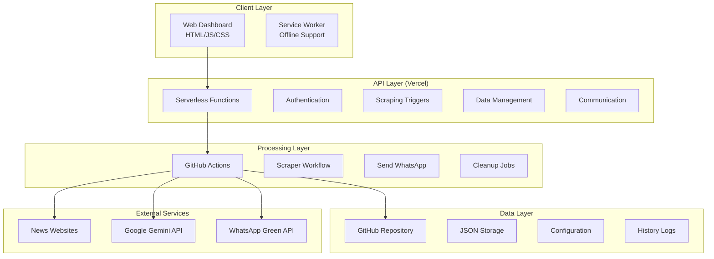

# Singapore News Scraper Developer Guide

This guide provides comprehensive information for developers working on the Singapore News Scraper project.

## Table of Contents

1. [Architecture Overview](#architecture-overview)
2. [Development Setup](#development-setup)
3. [Project Structure](#project-structure)
4. [Core Components](#core-components)
5. [Adding New Features](#adding-new-features)
6. [Testing](#testing)
7. [Deployment](#deployment)
8. [Best Practices](#best-practices)
9. [Troubleshooting](#troubleshooting)

## Architecture Overview



### Technology Stack

- **Frontend**: Vanilla JavaScript, Tailwind CSS, Chart.js
- **Backend**: Node.js (Vercel Serverless Functions)
- **Automation**: GitHub Actions, Python 3.x
- **Storage**: GitHub Repository (JSON files)
- **APIs**: Google Gemini, WhatsApp Green API
- **Deployment**: GitHub Pages (Frontend), Vercel (API)

## Development Setup

### Prerequisites

```bash
# Required tools
node >= 16.0.0
python >= 3.8
git >= 2.0.0
npm >= 7.0.0
```

### Local Development

1. **Clone the repository**
```bash
git clone https://github.com/djyalu/singapore_news_github.git
cd singapore_news_github
```

2. **Install dependencies**
```bash
# Frontend dependencies
npm install

# Python dependencies
pip install -r requirements.txt
```

3. **Set up environment variables**
```bash
# Create .env file
cat > .env << EOF
GITHUB_TOKEN=your_github_token
GITHUB_OWNER=your_username
GITHUB_REPO=singapore_news_github
WHATSAPP_API_KEY=your_whatsapp_key
GOOGLE_GEMINI_API_KEY=your_gemini_key
EOF
```

4. **Run local development server**
```bash
# Using Python
python -m http.server 8000

# Or using Node.js
npx http-server -p 8000
```

5. **Test Vercel functions locally**
```bash
npm install -g vercel
vercel dev
```

## Project Structure

```
singapore_news_github/
├── api/                      # Vercel serverless functions
│   ├── auth.js              # Authentication endpoint
│   ├── trigger-scraping.js  # Scraping workflow trigger
│   ├── save-data.js         # Data persistence
│   └── ...                  # Other API endpoints
├── scripts/                  # Python automation scripts
│   ├── scraper.py           # Main scraping logic
│   ├── ai_scraper.py        # AI-enhanced scraping
│   ├── send_whatsapp_green.py # WhatsApp integration
│   └── ...                  # Utility scripts
├── js/                       # Frontend JavaScript
│   ├── app.js               # Main application logic
│   ├── auth.js              # Authentication system
│   └── offline-fallback.js  # PWA offline support
├── css/                      # Stylesheets
│   └── styles.css           # Main styles
├── data/                     # Data storage
│   ├── settings.json        # Application settings
│   ├── sites.json           # News sites configuration
│   ├── scraped/             # Scraped articles
│   └── history/             # WhatsApp send history
├── .github/workflows/        # GitHub Actions
│   ├── scraper.yml          # Main workflow
│   └── ...                  # Other workflows
└── docs/                     # Documentation
```

## Core Components

### 1. Scraping System

#### Traditional Scraper (`scripts/scraper.py`)

```python
def extract_articles_generic(soup, base_url, site_name):
    """
    Generic article extractor for news sites
    
    Args:
        soup: BeautifulSoup object of the page
        base_url: Base URL for relative links
        site_name: Name of the news site
    
    Returns:
        list: Extracted articles with title, url, summary
    """
    articles = []
    # Implementation details...
```

Key functions:
- `load_settings()`: Dynamic settings loading
- `scrape_site()`: Main scraping logic
- `extract_articles_*()`: Site-specific extractors
- `save_scraped_data()`: Data persistence

#### AI Scraper (`scripts/ai_scraper.py`)

```python
class AIScraper:
    def __init__(self, api_key, cache_file='data/ai_cache.json'):
        """Initialize AI scraper with Gemini API"""
        self.model = genai.GenerativeModel('gemini-1.5-flash')
        self.cache = self._load_cache(cache_file)
```

Features:
- Content understanding with Gemini API
- Intelligent article extraction
- Korean summary generation
- API rate limiting (14 requests/minute)
- Multi-level caching system

### 2. API Endpoints

#### Authentication (`api/auth.js`)

```javascript
// Unified authentication and settings endpoint
// GET: Retrieve settings
// POST: User login

module.exports = async (req, res) => {
    if (req.method === 'GET' && req.query.type === 'settings') {
        // Return current settings and sites
    } else if (req.method === 'POST' && body.type === 'login') {
        // Handle user authentication
    }
};
```

#### Data Management (`api/save-data.js`)

```javascript
// Unified data saving endpoint
// Handles both settings and sites updates

const updateData = async (type, data) => {
    const octokit = new Octokit({ auth: process.env.GITHUB_TOKEN });
    // Update GitHub repository files
};
```

### 3. Frontend Application

#### Main App (`js/app.js`)

```javascript
// Application state management
const AppState = {
    settings: {},
    sites: [],
    latestScraped: [],
    user: null
};

// Key functions
async function loadSettings() { }
async function triggerScraping() { }
async function displayLatestScraped() { }
```

#### Authentication (`js/auth.js`)

```javascript
// Session-based authentication
const Auth = {
    login: async (username, password) => { },
    logout: () => { },
    isAuthenticated: () => { },
    requireAuth: () => { }
};
```

### 4. GitHub Actions Workflows

#### Main Workflow (`scraper.yml`)

```yaml
name: Singapore News Scraper
on:
  schedule:
    - cron: '55 22 * * *'  # 07:55 KST daily
  workflow_dispatch:       # Manual trigger

jobs:
  scrape-and-send:
    runs-on: ubuntu-latest
    timeout-minutes: 45
    steps:
      - uses: actions/checkout@v3
      - uses: actions/setup-python@v4
      - run: python scripts/scraper.py
      - run: python scripts/send_whatsapp_green.py
```

## Adding New Features

### 1. Adding a New News Site

1. **Update sites configuration** (`data/sites.json`):
```json
{
  "name": "New Site Name",
  "url": "https://newsite.com",
  "group": "News",
  "enabled": true
}
```

2. **Add site-specific extractor** (`scripts/scraper.py`):
```python
def extract_articles_newsite(soup, base_url):
    """Extract articles from New Site"""
    articles = []
    # Add extraction logic
    return articles
```

3. **Update scraper logic**:
```python
# In scrape_site() function
if 'newsite.com' in url:
    articles = extract_articles_newsite(soup, base_url)
```

### 2. Adding a New API Endpoint

1. **Create new function** (`api/new-endpoint.js`):
```javascript
module.exports = async (req, res) => {
    // Set CORS headers
    res.setHeader('Access-Control-Allow-Origin', '*');
    
    // Handle request
    try {
        // Your logic here
        res.status(200).json({ success: true });
    } catch (error) {
        res.status(500).json({ error: error.message });
    }
};
```

2. **Update frontend** (`js/app.js`):
```javascript
async function callNewEndpoint(data) {
    const response = await fetch('/api/new-endpoint', {
        method: 'POST',
        headers: { 'Content-Type': 'application/json' },
        body: JSON.stringify(data)
    });
    return response.json();
}
```

### 3. Adding New Scraping Method

1. **Create new scraper module** (`scripts/new_scraper.py`):
```python
def new_scraping_method(sites, settings):
    """Implement new scraping approach"""
    scraped_articles = []
    # Implementation
    return scraped_articles
```

2. **Update main scraper**:
```python
# In main() function
if settings.get('scrapingMethod') == 'new':
    from new_scraper import new_scraping_method
    articles = new_scraping_method(sites, settings)
```

## Testing

### Unit Testing

```python
# tests/test_scraper.py
import unittest
from scripts.scraper import clean_text, is_recent_article

class TestScraper(unittest.TestCase):
    def test_clean_text(self):
        text = "<p>Test   text</p>"
        cleaned = clean_text(text)
        self.assertEqual(cleaned, "Test text")
```

### Integration Testing

```bash
# Test scraping functionality
python scripts/scraper.py --test

# Test API endpoints
curl http://localhost:3000/api/test-env

# Test WhatsApp integration
python scripts/test_whatsapp.py
```

### Manual Testing Checklist

- [ ] Login/logout functionality
- [ ] Scraping execution
- [ ] WhatsApp message delivery
- [ ] Settings persistence
- [ ] Data cleanup
- [ ] Error handling

## Deployment

### Frontend Deployment (GitHub Pages)

1. Push changes to main branch
2. GitHub Pages automatically deploys from `/` directory
3. Access at: `https://[username].github.io/singapore_news_github/`

### API Deployment (Vercel)

1. **Connect GitHub repository to Vercel**
2. **Configure environment variables**
3. **Deploy**:
```bash
vercel --prod
```

### GitHub Actions Setup

1. **Add repository secrets**:
   - `GOOGLE_GEMINI_API_KEY`
   - Other required secrets

2. **Enable workflows**:
   - Go to Actions tab
   - Enable all workflows

## Best Practices

### Code Style

1. **Python**:
   - Follow PEP 8
   - Use type hints
   - Add docstrings

2. **JavaScript**:
   - Use ES6+ features
   - Async/await over callbacks
   - JSDoc comments

3. **General**:
   - Meaningful variable names
   - Small, focused functions
   - Error handling at all levels

### Security

1. **Never commit secrets**
2. **Validate all inputs**
3. **Use environment variables**
4. **Implement rate limiting**
5. **Regular dependency updates**

### Performance

1. **Optimize API calls**:
   - Batch operations
   - Implement caching
   - Use pagination

2. **Frontend optimization**:
   - Lazy loading
   - Minimize DOM operations
   - Use service workers

### Git Workflow

```bash
# Feature branch workflow
git checkout -b feature/new-feature
git add .
git commit -m "feat: add new feature"
git push origin feature/new-feature
# Create pull request
```

Commit message format:
- `feat:` New feature
- `fix:` Bug fix
- `docs:` Documentation
- `style:` Formatting
- `refactor:` Code restructuring
- `test:` Tests
- `chore:` Maintenance

## Troubleshooting

### Common Issues

1. **Vercel deployment fails**
   - Check build logs
   - Verify environment variables
   - Ensure dependencies are listed

2. **Scraping returns no results**
   - Check site selectors
   - Verify network connectivity
   - Review error logs

3. **GitHub Actions timeout**
   - Optimize scraping logic
   - Reduce number of sites
   - Increase timeout limit

### Debug Mode

```python
# Enable debug logging
DEBUG_MODE = os.environ.get('DEBUG_SCRAPER', 'false').lower() == 'true'
```

```javascript
// Frontend debugging
const DEBUG = localStorage.getItem('debug') === 'true';
if (DEBUG) console.log('Debug info:', data);
```

### Monitoring

1. **GitHub Actions logs**
2. **Vercel function logs**
3. **Browser console**
4. **Python script output**

## Contributing

1. Fork the repository
2. Create feature branch
3. Write tests
4. Submit pull request
5. Address review comments

### Code Review Checklist

- [ ] Tests pass
- [ ] Documentation updated
- [ ] No hardcoded values
- [ ] Error handling implemented
- [ ] Performance considered
- [ ] Security reviewed